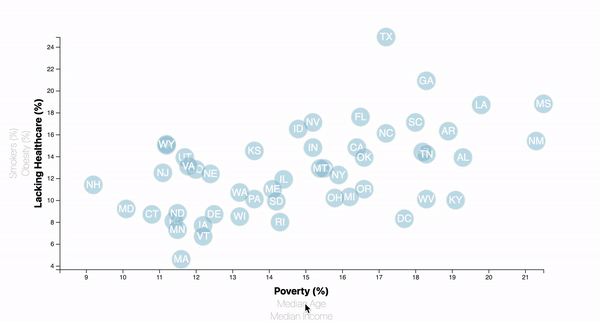

# census-dashboard
Interactive dashboard made with D3 to explore census data. 

View the dashboard [here](https://mvhaynes.github.io/census-dashboard/). 

## Table

The interactive table allows users to choose which datasets to view and then table will automatically rescale transition to the new plot. 